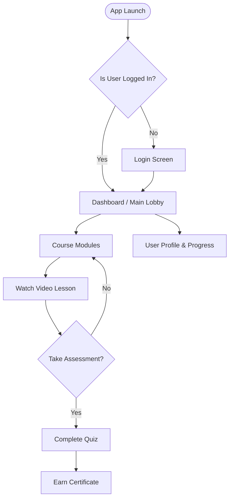

# Application Architecture & Flow Guide

## 1. Overview
The Learning App is a modern React Native application. It was recently migrated from an embedded SDK architecture into a standalone, fully decoupled app. The app relies on **React Native**, **Redux Toolkit** (for state management and RTK Query for API fetching), and **React Navigation** (for routing).

## 2. Directory Structure & Feature-Based Architecture
The application uses a **Feature-Based Architecture**, meaning code is grouped by domain (e.g., dashboard, video, assessments) rather than by type (e.g., components, screens, reducers). This pattern ensures that everything related to a specific feature lives in one place.

```text
src/
├── App.tsx                  # Root component, initializes Redux store and Navigation
├── appConfig.ts             # Central configuration (Base URL, mock toggle, API keys)
├── core/                    # Shared core configurations and services
│   ├── api/                 # RTK Query API configuration (baseApi.ts, apiConfig.ts)
│   ├── store/               # Redux store setup and app-level slices (appSlice, authSlice)
│   ├── theme/               # Design tokens, colors, and global styles
│   └── types/               # Global TypeScript definitions
├── features/                # Domain-specific feature modules
│   ├── assessments/         # Quiz and test screens/logic
│   ├── certificates/        # Certificate generation and viewing
│   ├── dashboard/           # Main landing screen
│   ├── modules/             # Course modules and structure
│   ├── progress/            # User progress tracking
│   └── video/               # Video player integration (HLS streams)
├── navigation/              # React Navigation routers (RootNavigator, MainTabNavigator)
└── shared/                  # Reusable UI components and utilities across features
```

## 3. Application Boot Flow
1. **`index.js`**: The React Native entry point that registers the main app component.
2. **`src/App.tsx`**: Renders the Root component.
   - Initializes the Redux `store`.
   - Dispatches `initializeApp` (injects config like base URL from `appConfig.ts` into Redux).
   - Dispatches `launchApp` to set the app to a "ready" state.
   - Wraps the app in `<Provider>` (Redux) and `<SafeAreaProvider>` (React Native Safe Area context).
   - Renders `<RootNavigator />`.
3. **`src/navigation/RootNavigator.tsx`**: Handles primary routing (e.g., switching between unauthenticated auth stacks, main tabs, or specific modal screens).

## 4. API and Data Flow
The app uses **RTK Query** for caching and remote data fetching, avoiding the need for manual data syncing in Redux slices.

1. **Central API Config (`src/core/api/apiConfig.ts`)**: This is the single source of truth for endpoints, backend URLs, and data transformers. Whenever the backend API contract changes, you only need to update this file.
2. **Base API (`src/core/api/baseApi.ts`)**: Configures the RTK Query `fetchBaseQuery` to automatically append authorization headers (`Bearer token`) and the dynamic base URL (`X-Base-URL`).
3. **Mock Data Mode (`src/appConfig.ts`)**: By toggling `USE_MOCK = true`, the app bypasses live API endpoints and uses local mock data—ideal for rapid UI development without a backend.
4. **Data Transformers**: Backend API responses are parsed and converted to app-specific types in `apiConfig.ts` (e.g., `transformVideoListToLessons`, `transformQuestionsToAssessment`). This completely decouples UI components from backend schemas.

## 5. Future Expansions & Scaling
When extending the application, follow these guidelines to maintain stability and organization:

### A. Adding a New Feature
1. Create a new folder under `src/features/` (e.g., `src/features/gamification`).
2. Include the UI screens, local components, and injected RTK Query API endpoints inside this folder.
3. Export the main screens and register them in `src/navigation/MainTabNavigator.tsx` or `RootNavigator.tsx`.

### B. Updating or Expanding the API
1. Add the new URL format to `API_URLS` in `src/core/api/apiConfig.ts`.
2. Write any new data transformers in `apiConfig.ts` if the backend format differs from the app's internal interfaces.
3. Inject the new endpoints in the respective feature API slice using `baseApi.injectEndpoints()`. Do not create multiple `createApi` instances unless connecting to an entirely unrelated secondary backend.

### C. Scaling State Management
- **Keep it local:** Avoid adding global state unless absolutely necessary. For local component state, use standard `useState` or `useReducer`.
- **Rely on caching:** For server data, rely entirely on RTK Query caching. Don't write manual `thunks` to fetch and store server data.
- **Client State:** If an app-wide client state is genuinely needed (e.g., user theme preference, deep linking state), add a slice to `src/core/store/`.

## 6. Development Workflow Tips
- **Toggle Backend Environment:** Edit `src/appConfig.ts` to quickly switch between staging/production backend (`baseUrl`) or mock data (`USE_MOCK`).
- **Consistent Styling:** Use the theme definitions in `src/core/theme/` rather than hardcoding hex colors, font sizes, or spacing values.
- **Navigation Nesting:** Avoid deeply nested monolithic navigators. Domain-specific screens should be housed in feature-specific stack navigators, which are then integrated into the global root tabs.

## 7. App Flow for Non-Technical Users
Imagine the app as a well-organized school building:

1. **The Entrance (App Booting Up):** When you tap the app icon, the app wakes up. It checks its map (Configuration) to know where to get its data, such as whether it should connect to the live internet or use internal practice data.
2. **The Lobby (Dashboard & Navigation):** Once inside, you see the Dashboard. Think of this as the main lobby with signs pointing to different rooms (Courses, Profile, Progress). The navigation system acts as your invisible guide, instantly teleporting you from room to room when you tap a button.
3. **The Classrooms (Features):**
   - **Modules & Video:** You enter a classroom to watch educational videos.
   - **Assessments:** After learning, you are handed a quiz to test your knowledge.
   - **Progress & Certificates:** As you complete quizzes, the app tracks your progress in a digital report card and eventually awards you a certificate.
4. **The Library (Data & API):** Whenever the app needs new information—like loading the next video or saving your quiz score—it sends a request to the "Library" (the Backend Server over the internet). If the library is closed or you are testing the app offline, it can use "practice books" (Mock Data) to keep working seamlessly.

## 8. Visual Diagrams

### The User Journey


### Data Flow (Under the Hood)
```mermaid
flowchart LR
    A[You\n(Tapping the Screen)] --> B[App Screen\n(React Native)]
    B --> C[Central API\n(The 'Library')]
    
    C -- "If USE_MOCK = true" --> D[(Local Mock Data)]
    C -- "If USE_MOCK = false" --> E[(Live Internet Backend)]
    
    D --> B
    E --> B
```
